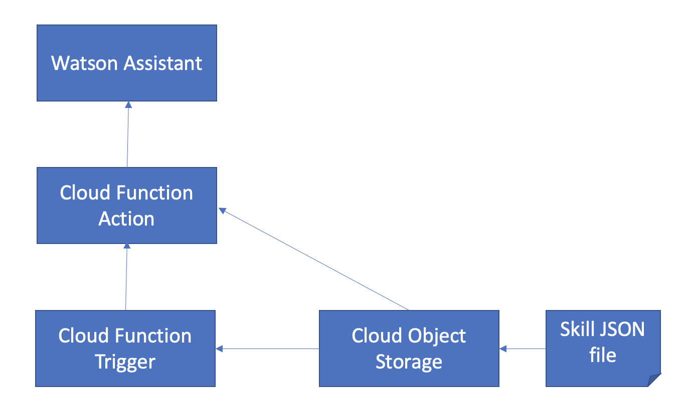
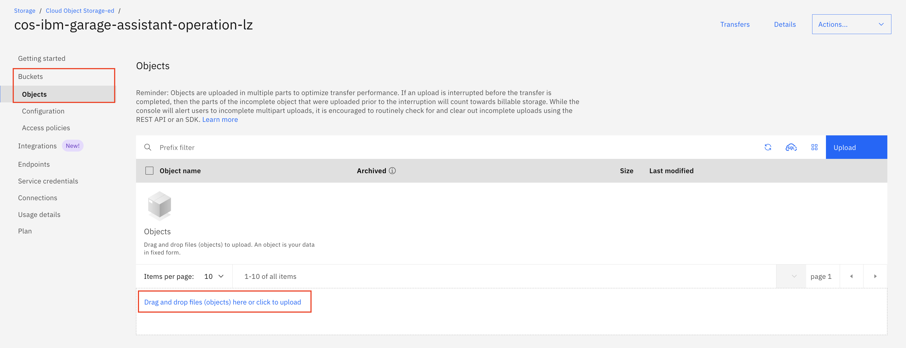
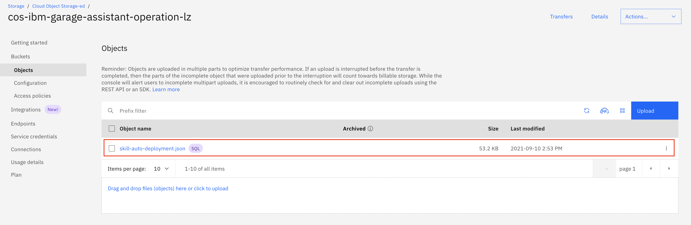

# Watson Assistant Skill Deployment Automation

One of the administrator's tasks is to deploy the Watson Assistant skill to production system, after it's developed in the development environment and verified in the testing environment. You may perform the deployment task manually via the UI. This repo discusses how you can automate the task.


## Overview and Components

When you deploy a skill to Watson Assistant, you uploads a JSON input file which provides the skill definition. It can be done manually on the UI or programatically by calling Assistant API. As you are going to automate the process, this exercise will deploy skill through API calls.

Watson Assistant skill JSON file can be stored in different places, in local file system, in remote file system, in cloud and etc. For simplicity ad demonstration purpose, this repo stores Watson Assistant skill JSON file in IBM Cloud Object Storage bucket.

You also have choices of how you develop and deploy your code for the automation. This repo provides Node.js sample code. The code is deployed as IBM Cloud Function for simplicity reason.




This repo utilizes 3 IBM Cloud services to automate Watson Assistant skill deployment process
- Watson Assistant
- Cloud Object Storage
- Cloud Function

When you run your Watson Assistant instance in IBM Cloud, this architecture makes it completely self-contained in one environment.


## Flow and Use Case

There are different options to automate a Watson Assistant skill deployment. In this repo, the following use case is used for discussion.

1. A skill JSON file is copied/moved to a bucket of IBM Cloud Object Storage when it's ready to be deployed to production system.
1. The arrival JSON file in the bucket sends a notification to the Cloud Function trigger.
1. The Cloud Function trigger activates the Cloud Function action
1. The Cloud Function action makes S3 API calls to retrieve JSON file from S3 bucket.
1. The Cloud Function action makes Watson Assistant API calls and deploys the Watson Assistant skill.

> Note: moving JSON file to a S3 bucket can be done manually or the result of another pipeline or automation process. How to completely automate the entire Watson Assistant administration tasks is out of discussion scope of this repo.


## Exercise Flow

### Step 1 - Clone the Repository

The repo provides sample Node.js code `app.js` as the starting point of the exercise. Feel free to modify the code if you have specific requirements

1. Open a `terminal` window on your local machine.

1. Navigate to a folder where you use to clone the repo.

1. Clone the repo

    ```
    git clone https://github.com/lee-zhg/watson-chatbot-deployment-automation
    ```

1. Navigate to the folder where the repo is downloaded.

    ```
    cd watson-chatbot-deployment-automation
    ```

> Note: The repo also provides sample codes that comsume input parameters in different ways. For exmaple, taking a local JSON file as the source file when deploying a new Watson Assistant skill.


### Step 2 - Configure IBM Cloud Object Storage

A bucket in IBM Cloud Object Storage is used as a file storage to store Watson Assistant JSON skill file.


#### Step 2.1 - Configure IBM Cloud Shell for your IBM Cloud Object Storage Instance

You must have an IBM Cloud Object Storage instance for the remaining of the exercise. If you don't have one, create one. 

To identify your IBM Cloud Object Storage Instance name,

1. Login to IBM Cloud in a browser.

1. Open the `IBM Cloud Shell`. The `IBM Cloud Shell` is opened in a separate tab.

1. Since you were authenticated when you logined to the IBM Cloud, you are automatically autenticated in the `IBM Cloud Shell`.

1. Target a resource group by executing

   ```
   ibmcloud target -g Default
   ```

   > Note: you may use a different resource group in your account.


1. Retrieve all services

    ```
    ibmcloud resource service-instances
    ```

1. Sample output looks like

    ```
    Name                                Location   State    Type   
    IBM Log Analysis-cb                 us-east    active   service_instance   
    IBM Cloud Monitoring-pe             us-east    active   service_instance   
    kube-certmgr-c4f9d9pd0psfkjhab1bg   us-south   active   service_instance   
    Cloudant-bv                         us-south   active   service_instance   
    Language Translator-14              us-south   active   service_instance   
    Watson Assistant-j3                 us-south   active   service_instance   
    Speech to Text-av                   us-south   active   service_instance   
    Text to Speech-hu                   us-south   active   service_instance   
    Watson Studio-yv                    us-south   active   service_instance   
    IBM Cognos Dashboard Embedded-n5    us-south   active   service_instance   
    Cloud Object Storage-ed             global     active   service_instance   
    Cloud-Function-NS                   us-south   active   service_instance   
    Certificate Manager-ym              us-south   active   service_instance   
    Db2-ul                              us-south   active   service_instance   
    Watson Discovery-4m                 us-south   active   service_instance   
    Databases for Redis-eg              us-south   active   service_instance   
    ```

1. For the above example, `Cloud Object Storage-ed` is the name of your s3 instance.

1. Store the Cloud Object Storage instance name in environment variable.

    ```
    export S3_NAME="Cloud Object Storage-ed"
    ```

1. Retrieve additional information for your IBM Cloud Object Storage instance.

    ```
    ibmcloud resource  service-instance "$S3_NAME"
    ```

    For example,

    ```
    ibmcloud resource  service-instance "Cloud Object Storage-ed"
    ```

1. Sample output looks like

    ```
    Name:                  Cloud Object Storage-ed   
    ID:                    crn:v1:bluemix:public:cloud-object-storage:global:a/d31616cb766c4803baf1441fbd96b066:a21da977-07c2-41ff-a2f4-a90134be92d0::   
    GUID:                  a21da977-07c2-41ff-a2f4-a90134be92d0   
    Location:              global   
    Service Name:          cloud-object-storage   
    Service Plan Name:     standard   
    Resource Group Name:   Default   
    State:                 active   
    Type:                  service_instance   
    Sub Type:                 
    Created at:            2021-08-19T17:52:45Z   
    Created by:            Max.Simpson@ibm.com   
    Updated at:            2021-08-19T17:52:47Z   
    Last Operation:                        
                        Status    create succeeded      
                        Message   Completed create instance operation   
    ```

1. In the above example, `a21da977-07c2-41ff-a2f4-a90134be92d0` is the `GUID`.

1. In the above example, `crn:v1:bluemix:public:cloud-object-storage:global:a/d31616cb766c4803baf1441fbd96b066:a21da977-07c2-41ff-a2f4-a90134be92d0::` is the `ID`.

1. Store `GUID` in environment variable.

    ```
    export S3_GUID="a21da977-07c2-41ff-a2f4-a90134be92d0"
    ```

1. Confirm the `GUID` in the environment variable.

    ```
    echo $S3_GUID
    ```

1. Store `ID` in environment variable.

    ```
    export S3_ID="crn:v1:bluemix:public:cloud-object-storage:global:a/d31616cb766c4803baf1441fbd96b066:a21da977-07c2-41ff-a2f4-a90134be92d0::"
    ```

1. Confirm the `ID` in the environment variable.

    ```
    echo $S3_ID
    ```
1. Configure s3 plugin configuration to point to your IBM Cloud Object Storage instance.

    ```
    ibmcloud cos config crn --crn "$S3_GUID"
    ```

1. Verify the s3 plugin configuration.

    ```
    ibmcloud cos config list
    ```

1. Sample output looks like

    ```
    Key                     Value   
    Last Updated            Thursday, September 09 2021 at 19:03:05   
    Default Region          us-south   
    Download Location       /Users/leezhang/Downloads   
    CRN                     a21da977-07c2-41ff-a2f4-a90134be92d0   
    AccessKeyID                
    SecretAccessKey            
    Authentication Method   IAM   
    URL Style               VHost   
    Service Endpoint         
    ```


#### Step 2.2 - Create a Bucket

To create a new bucket `cos-ibm-garage-assistant-operation-<your initial>` in your IBM Cloud Object Storage instance,

1. Store bucket name `cos-ibm-garage-assistant-operation-<your initial>` in a environment variable.

    ```
    export BUCKET_NAME="cos-ibm-garage-assistant-operation-<your initial>"
    ```

1. Execute command

    ```
    ibmcloud cos create-bucket --bucket "$BUCKET_NAME" --region us-south --class SMART
    ```

1. Optionally, you may pass your IBM Cloud Object Storage instance as part of the above command
    ```
    ibmcloud cos create-bucket --bucket "$BUCKET_NAME" --region us-south --class SMART --ibm-service-instance-id "$S3_ID"
    ```

1. Verify the new bucket was created successfully.

    ```
    ibmcloud cos bucket-location-get --bucket "$BUCKET_NAME"
    ```

Alternatively, you may also create S3 bucket via IBM Cloud UI.


#### Step 2.3 - Create Cloud Object Storage Credential

For simplicity, a new credential `ibm-garage-cos-assistant-operation` is created for your Cloud Object Storage instance. Alternatively, you may use the existing credential.

1. Store the new credential name in a environment variable.

    ```
    export S3_CREDENTIAL="ibm-garage-cos-assistant-operation"
    ```

1. Create a new credential `ibm-garage-cos-assistant-operation` for your Cloud Object Storage instance.

    ```
    ibmcloud resource service-key-create "$S3_CREDENTIAL" Writer --instance-name "$S3_NAME"
    ```

1. Verify the new credential.

    ```
    ibmcloud resource service-key "$S3_CREDENTIAL" 
    ```


### Step 3 - Configure Watson Assistant

For simplicity, a new credential `ibm-garage-assistant-operation` is created for your Watson Assistant instance. Alternatively, you may use the existing credential.

1. In your `IBM Cloud Shell`, store the new credential name in a environment variable.

    ```
    export ASSISTANT_CREDENTIAL="ibm-garage-assistant-operation"
    ```

1. Retrieve all services.

    ```
    ibmcloud resource service-instances
    ```

1. Sample output looks like

    ```
    Name                                Location   State    Type   
    IBM Log Analysis-cb                 us-east    active   service_instance   
    IBM Cloud Monitoring-pe             us-east    active   service_instance   
    kube-certmgr-c4f9d9pd0psfkjhab1bg   us-south   active   service_instance   
    Cloudant-bv                         us-south   active   service_instance   
    Language Translator-14              us-south   active   service_instance   
    Watson Assistant-j3                 us-south   active   service_instance   
    Speech to Text-av                   us-south   active   service_instance   
    Text to Speech-hu                   us-south   active   service_instance   
    Watson Studio-yv                    us-south   active   service_instance   
    IBM Cognos Dashboard Embedded-n5    us-south   active   service_instance   
    Cloud Object Storage-ed             global     active   service_instance   
    Cloud-Function-NS                   us-south   active   service_instance   
    Certificate Manager-ym              us-south   active   service_instance   
    Db2-ul                              us-south   active   service_instance   
    Watson Discovery-4m                 us-south   active   service_instance   
    Databases for Redis-eg              us-south   active   service_instance   
    ```

1. For the above example, `Watson Assistant-j3` is the name of your Watson Assistant instance.

1. Store the Watson Assistant instance name in environment variable.

    ```
    export ASSISTANT_NAME="Watson Assistant-j3"
    ```

1. Create a new credential `ibm-garage-assistant-operation` for your Watson Assistant instance.

    ```
    ibmcloud resource service-key-create "$ASSISTANT_CREDENTIAL" Manager --instance-name "$ASSISTANT_NAME"
    ```

1. Verify the new credential.

    ```
    ibmcloud resource service-key "$ASSISTANT_CREDENTIAL"
    ```


### Step 4 - Configure IBM Cloud Function

In this section, you deploy your code as a service in IBM Cloud Function. Because the Cloud Functions is not the focus of the repo, basic CLI commands are used to show the procedure.


#### Step 4.1 - Deploy Cloud Function

1. Still in your `IBM Cloud Shell`.

1. Optionally, create a Cloud Function Namespace. Execute

   ```
   ibmcloud fn namespace create <my namespace> --description "my namespace"
   ```

1. Verify the new namespace was created.

   ```
   ibmcloud fn namespace list
   ```

1. Set the new namespace as default

   ```
   ibmcloud fn property set --namespace <my namespace>
   ```

1. Store new package name `assistant-operation` in environment variable.

    ```
    export CF_PACKAGE="assistant-operation"
    ```

1. Create package

   ```
   ibmcloud fn package create "$CF_PACKAGE"
   ```

1. Create action for setup using Node.js environment

   ```
   ibmcloud  fn  action  create  "$CF_PACKAGE"/assistant-deployment  app.js  --kind nodejs:12  --web  true  --web-secure  <YOURSECRET>
   ```

    > Note: <YOURSECRET> can be any text string that helps to keep your cloud functions secure. Note down <YOURSECRET> for future reference. For example, `team1a`.

1. Verify the action cloud function was created succerssfully.

   ```
   ibmcloud  fn  action  list  "$CF_PACKAGE"
   ```

Alternatively, you may also deploy the Cloud Function via IBM Cloud UI.


#### Step 4.2 - Create Cloud Function Trigger

Now, you have deployed a cloud function. If you like, you can launch the cloud function manually, get input from JSON file in S3 bucket and start a Watson Assistant skill deployment process.

However, the objective of this repo is to automate the Watson Assistant skill deployment process. You like to automatically launch the cloud function when a JSON file is moved to a S3 bucket. For this automation, you need to define a IBM Cloud Function `trigger`.

1. In your `IBM Cloud Shell`, create a trigger `assistant-auto-deployment` that fires when a JSON is uploaded to your specified S3 bucket `$BUCKET_NAME`.

   ```
    ibmcloud fn trigger create assistant-auto-deployment --feed /whisk.system/cos/changes --param bucket "$BUCKET_NAME" --param suffix "json" --param event_types write
    ```

1. Verify your trigger.

    ```
    ibmcloud fn trigger get assistant-auto-deployment
    ```

Alternatively, you may also create the Cloud Function trigger via IBM Cloud UI.


#### Step 4.3 - Create Cloud Function Rule

After you have created both cloud function and trigger, you are going to create a `rule` which associates your trigger with your action. With these three components in the IBM Cloud Function defined, your cloud function will be  automatically launched when a JSON file is moved to your S3 bucket.

1. In your `IBM Cloud Shell`, create a rule `assistant-auto-deployment-rule` that fires when a JSON is uploaded to your specified S3 bucket `$BUCKET_NAME`.

    ```
    ibmcloud fn rule create assistant-auto-deployment-rule assistant-auto-deployment "$CF_PACKAGE"/assistant-deployment
    ```

1. Verify your rule.

    ```
    ibmcloud fn rule get assistant-auto-deployment-rule
    ```

Alternatively, you may also associate your Cloud Function trigger and action via IBM Cloud UI.


#### Step 4.4 - Bind Cloud Function Package to Services in IBM Cloud

Cloud Function package helps organize your Cloud Function actions. Typically, you have all actions for one job category under one package. For example, you created package `assistant-operation` in the previous section and then you created action `assistant-deployment` in the package. The action is referred as `assistant-operation/assistant-deployment`. When you create another action for skill backup automation, you may use the same package.

Cloud Function action communicates with services in IBM Cloud. It uses parameters to store service credentials for the connectivity to services in IBM Cloud. You may add action parameter manually. Or, you can `bind` services in IBM Cloud to Cloud Function action. After binding, the service credentials are automatically added to the action.

You have choice to `bind` parameters to individual action or to a package. When you bind parameters to a package, all of the actions within the package inherit those parameters unless otherwise specified.

For this exercise, the Cloud Function interacts with 2 services in IBM Cloud.
- Cloud Object Storage
- Watson Assistant

For `Cloud Object Storage` instance, its name and credentials are stored in environment variable `$S3_NAME` and `$S3_CREDNETIAL` in the previous sections.

For `Watson Assistant` instance, its name and credentials are stored in environment variable `$ASSISTANT_NAME` and `$ASSISTANT_CREDNETIAL` in the previous sections.

1. Bind Cloud Function package `assistant-operation` and Cloud Object Storage instance.

    ```
    ibmcloud fn service bind cloud-object-storage "$CF_PACKAGE" --instance "$S3_NAME" --keyname "$S3_CREDENTIAL"
    ```

1. Verify the binding. You should see one `cloud-object-storage` credential in the package.

    ```
    ibmcloud fn package get "$CF_PACKAGE"
    ```

1. Bind Cloud Function package `assistant-operation` and Watson Assistant instance.

    ```
    ibmcloud fn service bind conversation "$CF_PACKAGE" --instance "$ASSISTANT_NAME" --keyname "$ASSISTANT_CREDENTIAL"
    ```

1. Verify the binding. You should see both `conversation` and `cloud-object-storage` credential in the package.

    ```
    ibmcloud fn package get "$CF_PACKAGE"
    ```


### Step 5 - Verification

Couple of sample JSON files are provided in data/ subfolder for verifying your Watson Assistant skill deployment automation.


#### Step 5.1 - Create a New Skill

If you are doing this exercise the first time, `auto-deployment` skill should not exist in your Watson Assistant instance. Steps in this section will create it.


#### Step 5.1.1 - Upload Sample JSON File

1. Login to IBM Cloud in a browser. https://cloud.ibm.com.

1. Search and open your Cloud Object Storage instance.

1. Select `Buckets` link in the left navigation pane.

1.  Select `cos-ibm-garage-assistant-operation-<your initial>` bucket from the bucket list.

    

1. Select the `Drag and drop files (objects) here or click to upload` link at the bottom of the screen.

1. Select file `data/skill-auto-deployment.json` in the folder where you downloaded the repo.

1. Close the any pop-up window(s) if necessary.

1. You should have one JSON file `skill-auto-deployment.json` stored in the bucket.

    


##### Step 5.1.2 - Verify New Skill

To verify the skill `auto-deployment` was deployed to your Watson Assistant instance,

1. Open a new browsser tab.

1. Search and Open your Watson Assistant instance.

1. Select `Launch Watson Assistant` button.

1. Navigate to `Skills` tab  in the left pane.

1. Skill `auto-deployment` should appear in the main window.

1. Select the skill `auto-deployment` to open it and view its `intents`.

    

1. Intent `test` does not appears on the intent list.


#### Step 5.2 - Update an Existing Skill

Steps in this section illustrates that automatic skill deployment can also update an existing skill.


#### Step 5.2.1 - Upload Sample JSON File

1. Login to IBM Cloud in a browser. https://cloud.ibm.com.

1. Search and open your Cloud Object Storage instance.

1. Select `Buckets` link in the left navigation pane.

1.  Select `cos-ibm-garage-assistant-operation-<your initial>` bucket from the bucket list.

    

1. Select the `Drag and drop files (objects) here or click to upload` link at the bottom of the screen.

1. Select file `data/skill-auto-deployment-more.json` in the folder where you downloaded the repo.

1. Close the any pop-up window(s) if necessary.

1. You should have one JSON file `skill-auto-deployment-more.json` stored in the bucket.


##### Step 5.2.2 - Verify Skill Update

To verify the skill `auto-deployment` was updated in your Watson Assistant instance,

1. Open a new browsser tab.

1. Search and Open your Watson Assistant instance.

1. Select `Launch Watson Assistant` button.

1. Navigate to `Skills` tab  in the left pane.

1. Skill `auto-deployment` should appear in the main window.

1. Select the skill `auto-deployment` to open it and view its `intents`.

    

1. Intent `test` was added on the intent list.


## License

This code pattern is licensed under the Apache Software License, Version 2.  Separate third party code objects invoked within this code pattern are licensed by their respective providers pursuant to their own separate licenses. Contributions are subject to the [Developer Certificate of Origin, Version 1.1 (DCO)](https://developercertificate.org/) and the [Apache Software License, Version 2](https://www.apache.org/licenses/LICENSE-2.0.txt).

[Apache Software License (ASL) FAQ](https://www.apache.org/foundation/license-faq.html#WhatDoesItMEAN)

## Links

* [Demo on youtube](https://youtu.be/6QlAnqSiWvo)
* [IBM Watson Assistant Docs](https://cloud.ibm.com/docs/services/conversation/dialog-build.html#dialog-build)
* [Blog for IBM Watson Assistant Slots Code Pattern](https://developer.ibm.com/code/2017/09/19/managing-resources-efficiently-watson-conversation-slots/)

## Learn more

* **Artificial Intelligence Code Patterns**: Enjoyed this Code Pattern? Check out our other [AI Code Patterns](https://developer.ibm.com/technologies/artificial-intelligence/).
* **AI and Data Code Pattern Playlist**: Bookmark our [playlist](https://www.youtube.com/playlist?list=PLzUbsvIyrNfknNewObx5N7uGZ5FKH0Fde) with all of our Code Pattern videos
* **With Watson**: Want to take your Watson app to the next level? Looking to utilize Watson Brand assets? [Join the With Watson program](https://www.ibm.com/watson/with-watson/) to leverage exclusive brand, marketing, and tech resources to amplify and accelerate your Watson embedded commercial solution.
* **Kubernetes on IBM Cloud**: Deliver your apps with the combined the power of [Kubernetes and Docker on IBM Cloud](https://www.ibm.com/cloud/container-service)
