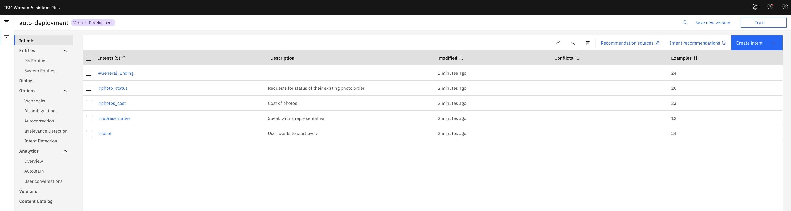
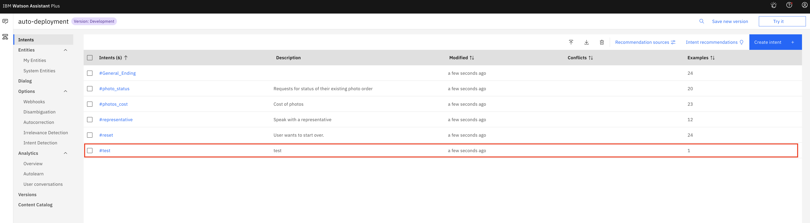
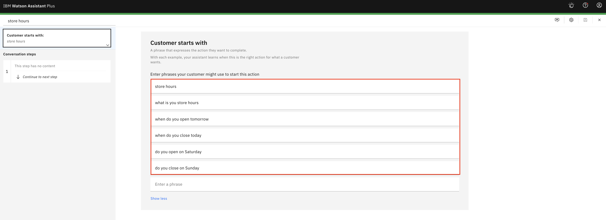
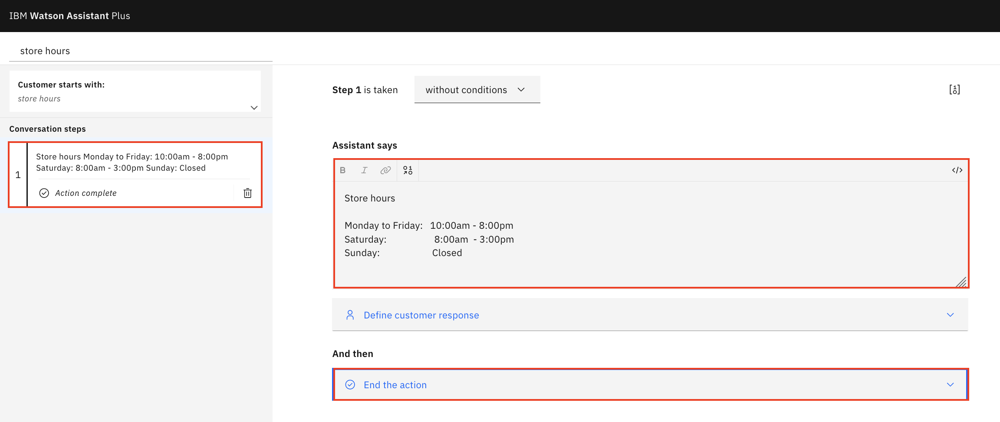
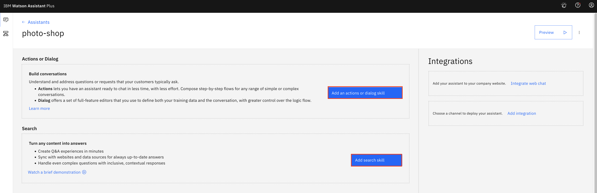
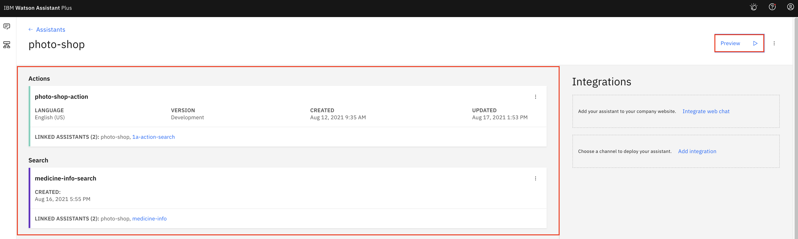
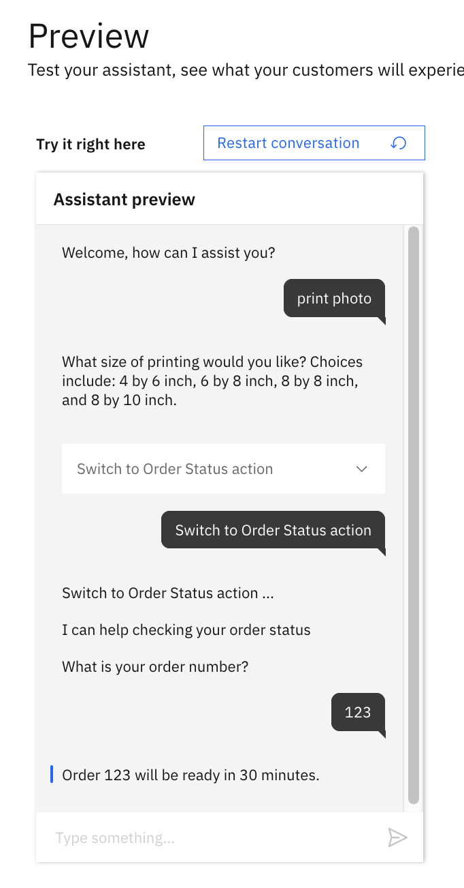
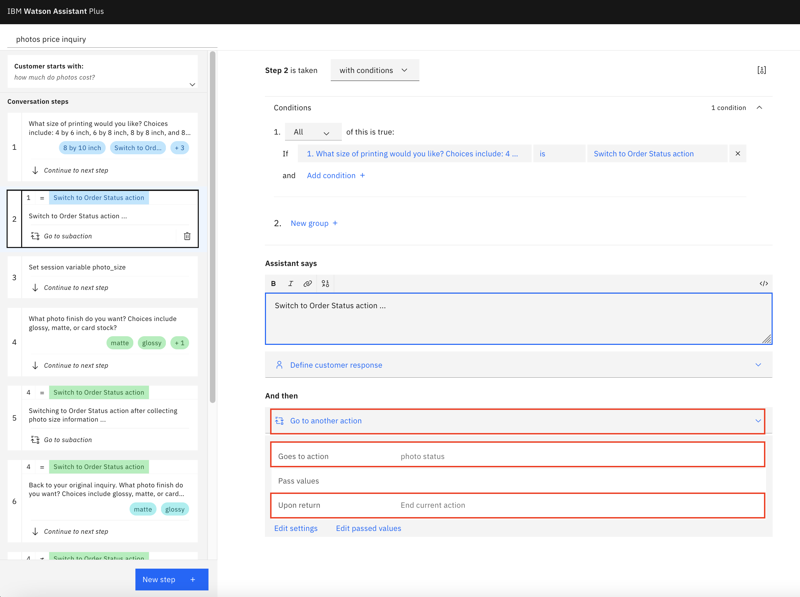
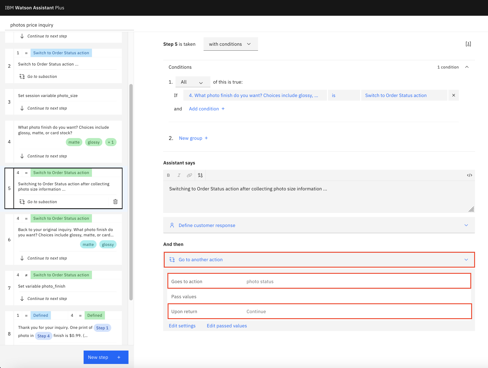

# Watson Assistant Skill Deployment Automation

`Actions skill` feature in `Watson Assistant` offers an intuitive and non-technical way to build a chatbot quickly. It requires no development experience or training, although it embeds the object-oriented concept. 

Basically, you breaks down your complex conversation flow into individual `actions`. Each action takes care of the conversation for a single task only, for example, checking order status, inquiring photo price or inquirying medicine information. `Actions skill` fabricates multiple actions (multiple simple conversations) together and makes the inter-connections of coversations between multiple subjects. As the result, your chatbot can engage a real-world conversation with the end users.

This approach dramatically reduces the complexity of the chatbot building process. It puts the power of AI in the hands of everyday citizen. Building an action is as easy as writing down the conversation flow to carry out an individual task. After you build all necessay actions, AI behind the `actions skill` takes care of the rest.


## New Ways to Build Chatbot

When building an action, you start by defining a set of user input examples. This is extremely similar to defining an `intent`. In fact, an intent is built for you automatically behind the scene. But, the intent is invisible from developers (as well as end users) perspective when working with action and actions skill. 

There is no explicit `entity` concept either, when building an action. You simply define what the bot responses are. Entities are built for you automatically behind the scene. So, the entity is also invisible from developers (as well as end users) perspective when working with action and actions skill. 

An action contains complete conversation flow to fulfill a single task or to cover a single subject. The action also takes care of related `intent` and `entities`. Everything for the conversation covering the task/subject is encapsulated in the `action`. Whenever you need to "talk" about the subject, the same action can be re-used.

A single action is not designed to stretch across multiple subjects or intents. Complex conversation flow involving multiple subjects, must be broken down into individual actions.

`Actions skill` is non-technical-users friendly. User inputs (entities) are stored automatically in variables with descriptive reference. Actions as individual dialog components can be re-arranged and moved freely. The order of the actions in an `actions skill` is irrelavent. 


## More Features is Coming

`Actions skill` is relatively new in `Watson Assistant`. It offers many great advantages over the traditional `dialog skill` and likely presents future direction of Watson Assistant.
- intuitive and non-technical-users friendly
- simplicity
- seamless switching between actions
- etc.

Some of features are still pending at the time of this writing.
- skill webhook
- pattern entity
- refer action within dialog skill


## Use Case

You are going to build a chatbot covering 4 subjects
- inquire order status
- inquire photo price
- inquire medicine information
- inquire store hours

Sample `actions skill` `skill-photo-shop-action.json` is provided in `data/` subfolder. It can serve as the starting point.

Action `inquire store hours` will be developed during the exercise.


## Exercise Flow

### Step 1 - Clone the Repository

The repo provides sample actions skill `skill-photo-shop-action.json` as the starting point of the exercise.

1. Open a `terminal` window on your local machine.

1. Navigate to a folder where you use to clone the repo.

1. Clone the repo

    ```
    git clone https://github.com/lee-zhg/waston-chatbot-action-skill
    ```

1. The sample actions skill `skill-photo-shop-action.json` locate in the `/data` sub-folder.


### Step 2 - Watson Discovery Service

Integration of `Watson Assistant` and `Watson Discovery` services is discussed in repo https://github.com/lee-zhg/waston-chatbot-discovery-integration. 

If you intend to have your chatbot cover all 4 above subjects, you may complete the integration exercise before continue in the exercise in this repo.

If you intend to not have your chatbot cover `inquire medicine information` subject, you may simply skip the `Watson Discovery` related deployment and configuration, and continue the exercise in this repo.


### Step 3 - Watson Assistant Service

In this section, you add one additional action to a sample `actions skill` to cover a new subject `inquire store hours`.


#### Step 3.1 - Import Sample Actions Skill

To save time, you start the chatbot development from a sample actions skill `skill-photo-shop-action.json`. It can be found in subfolder `data/`.

The sample chatbot covers 3 subjects
- inquiee order status
- inquire photo price
- inquire medicine information


#### Step 3.2 - Create new Action

Now, you are going to add one new `action` to cover the subject `inquire store hours`.

1. Login to IBM Cloud.

1. Search and Open the `Watson Assistant` instance.

1. Select `Launch Watson Assisatnt` button on the `Manage` tab.

1. Navigate to `Skill` tab.

1. Select the `photo-shop-action` tile and open it. This is the `actions skill` that you imported in the previous section.

    

1. Select `New action` button.

1. Type "store hours" in the `What does your customer say to start this interaction?`  field.

    >Note: you should provide many examples of what your customer says. This is the first example and it's used as the action name.

1. `Save`.

1. Optionally, you may rename the action.

1. Select `Customer starts with` tile in the left pane.

    

1. In the `Enter a phrase` field under `store hours`, enter a few additional examples of what a customer may say when saking for store hours. For example,

    - what is you store hours
    - when do you open tomorrow
    - when do you close today
    - do you open on Saturday
    - do you close on Sunday

1. Press `Enter` key or tab out the field after one example is enter.

    

1. Optionally, select `save` icon to save the changes.

1. Select `Step 1` in the left pane.

1. In the `Assistant says` field, enter

    ```
    Store hours:

    Monday to Friday:   10:00am - 8:00pm
    Saturday:           8:00am  - 3:00pm
    Sunday:             Closed
    ```

    

1. Change `And then` field to `End the action`.

1. Optionally, `save` the changes.

1. Selecth `Preview` button at the bottom-right.

1. Enter `store hour`.

1. The chatbot replies

    ```
    Store hours:

    Monday to Friday:   10:00am - 8:00pm
    Saturday:           8:00am  - 3:00pm
    Sunday:             Closed
    ```


#### Step 3.3 - Create Assistant

To create a new `assistant`,

1. Navigate to the `Assistant` tab in the left pane.

1. Select `Create assistant`.

1. Enter `photo-shop` in the `Name` field.

1. `Create assistant`.

    

1. Click `Add an actions or dialog skill` link.

1. Select `photo-shop-action` tile.

    > Note: if you choose to not integrate with `Watson Discovery` service, you may skip the rest of this section.

1. Click `Add search skill` link.

1. Select `medicine-info-search` tile.

    


### Step 4 - Verification

You have developed and deployed a chatbot based on `actions skill`. Now, you can run couple of tests and ensure that the chatbot works in the same way as if it's built via `dialog skill`.

The chatbot is built answer inquries in 4 subject areas.
- inquire order status
- inquire photo price
- inquire medicine information
- inquire store hours

You may ask any related questions in any order. The chatbot can provide answers as if it is built via `dialog skill`. You won't tell any difference if you only ask basic questions and complete conversation flow of each subject.

To run basic test cases,

1. Click `Preview` button at the top-right corner of the `Assistant` window.


#### Step 4.1 - Still Works in the Same Way as Before

Chatbot built in `actions skill` and chatbot built in `dialog skill` work similarly. 


##### Step 4.1.1 - Inquire Order Status

1. Enter `order status`.

1. The chatbot replies 

    ```
    I can help checking your order status
    What is your order number?
    ```
1. Enter `123`.

1. The chatbot replies 

    ```
    Order 123 will be ready in 30 minutes.
    ```


##### Step 4.1.2 - Inquire Photo Price

1. Enter `print photos`.

1. The chatbot replies 

    ```
    What size of printing would you like? Choices include: 4 by 6 inch, 6 by 8 inch, 8 by 8 inch, and 8 by 10 inch.
    ```

1. The chatbot also provides a list of options.

1. Enter `4x6`.

1. The chatbot replies 

    ```
    What photo finish do you want? Choices include glossy, matte, or card stock?
    ```

1. The chatbot provides 3 options
    - matte
    - glossy
    - Switch to Order Status action

1. Enter or select `glossy`.

1. The chatbot replies 

    ```
    Thank you for your inquiry. One print of 4 by 6 inch photo in glossy finish is $0.99. (4 by 6 inch, glossy)
    ```


##### Step 4.1.3 - Inquire Medicine Information

1. Enter `what is aspirin dosage?`.

1. The chatbot replies 

    ```
    Checking ...
    I searched my knowledge base and found this information which might be useful:

    Bayer Aspirin dose ranges from 50 mg to 6000 mg daily.
    ```


##### Step 4.1.4 - Inquire Store Hours

1. Enter `what is your store hours?`.

1. The chatbot replies 

    ```
    Store hours
    Monday to Friday: 10:00am - 8:00pm
    Saturday: 8:00am - 3:00pm
    Sunday: Closed
    ```


#### Step 4.2 - Switch Between Actions without Digression

One of the main advantage of `actions skill` is to be able to swtich to completely different subject in the mid of a conversation. This can be done easily via `actions skill` as it's one of the built-in features. 

`Dialog skill` also supports the subject switching with development efforts.

When you perform a subject switching in the mid of a conversation, you may choose to not return to the original conversation after the new conversation completes. So, when the new conversation completes, both new conversation and the original conversation completes.

You run a test case to end both new and original conversations in this section. The original conversation won't be resumed.

1. Select `Restart conversation` on the top.

1. You start a `inquire photo cost` conversation by entering `print photo`.

1. The chatbot replies 

    ```
    What size of printing would you like? Choices include: 4 by 6 inch, 6 by 8 inch, 8 by 8 inch, and 8 by 10 inch.
    ```

1. The chatbot also provides a list of options. 

1. Switch to `Order Status` conversation by entering `switch to order status action`.

1. The chatbot replies 

    ```
    Switch to Order Status action ...
    
    I can help checking your order status
    What is your order number?
    ```

1. You continue the `Order Status` conversation by entering `123`.

1. The chatbot replies with the message below and completes both new conversation and the original one.

    ```
    Order 123 will be ready in 30 minutes.
    ```

    

1. In `Step 2` of `photos price inquiry` action, you can find detail information of this subject switching configuration. 

    - `And then` is set to `Go to another action`.
    - `Goes to action` is set to `photo status`.
    - `Upon return` property is set to `End current action`.

    


#### Step 4.3 - Switch Between Actions with Corss-Action Digression

When you perform a subject switching in the mid of a conversation, you may also choose to return to the original conversation after the new conversation completes. So, when the new conversation completes, the original conversation resumes.

You run a test case to resume the original conversations in this section. 

1. Select `Restart conversation` on the top.

1. You start a `inquire photo cost` conversation by entering `print 4x6 photo`.

1. The chatbot replies 

    ```
    What photo finish do you want? Choices include glossy, matte, or card stock?
    ```

1. The chatbot also provides a list of options. 

1. Switch to `Order Status` conversation by entering `switch to order status action`.

1. The chatbot replies 

    ```
    Switching to Order Status action after collecting photo size information ...
    
    Changed mind? I can help checking order status
    What is your order number?
    ```

1. You continue the `Order Status` conversation by entering `123`.

1. The chatbot completes the new conversation and resumes the original one.

    ```
    Order 123 will be ready in 30 minutes.

    Back to your original inquiry.
    What photo finish do you want? Choices include glossy, matte, or card stock?
    ```

1. You can resume the original conversation by entering `glossy`.

1. The chatbot completes the original conversation.

    ```
    Thank you for your inquiry. One print of 4 by 6 inch photo in Switch to Order Status action finish is $0.99. (null, null)
    ```

    

1. In `Step 5` of `photos price inquiry` action, you can find detail information of this subject switching configuration. 
    - `And then` is set to `Go to another action`.
    - `Goes to action` is set to `photo status`.
    - `Upon return` property is set to `Continue`.

    


## License

This code pattern is licensed under the Apache Software License, Version 2.  Separate third party code objects invoked within this code pattern are licensed by their respective providers pursuant to their own separate licenses. Contributions are subject to the [Developer Certificate of Origin, Version 1.1 (DCO)](https://developercertificate.org/) and the [Apache Software License, Version 2](https://www.apache.org/licenses/LICENSE-2.0.txt).

[Apache Software License (ASL) FAQ](https://www.apache.org/foundation/license-faq.html#WhatDoesItMEAN)

## Links

* [Demo on youtube](https://youtu.be/6QlAnqSiWvo)
* [IBM Watson Assistant Docs](https://cloud.ibm.com/docs/services/conversation/dialog-build.html#dialog-build)
* [Blog for IBM Watson Assistant Slots Code Pattern](https://developer.ibm.com/code/2017/09/19/managing-resources-efficiently-watson-conversation-slots/)

## Learn more

* **Artificial Intelligence Code Patterns**: Enjoyed this Code Pattern? Check out our other [AI Code Patterns](https://developer.ibm.com/technologies/artificial-intelligence/).
* **AI and Data Code Pattern Playlist**: Bookmark our [playlist](https://www.youtube.com/playlist?list=PLzUbsvIyrNfknNewObx5N7uGZ5FKH0Fde) with all of our Code Pattern videos
* **With Watson**: Want to take your Watson app to the next level? Looking to utilize Watson Brand assets? [Join the With Watson program](https://www.ibm.com/watson/with-watson/) to leverage exclusive brand, marketing, and tech resources to amplify and accelerate your Watson embedded commercial solution.
* **Kubernetes on IBM Cloud**: Deliver your apps with the combined the power of [Kubernetes and Docker on IBM Cloud](https://www.ibm.com/cloud/container-service)
